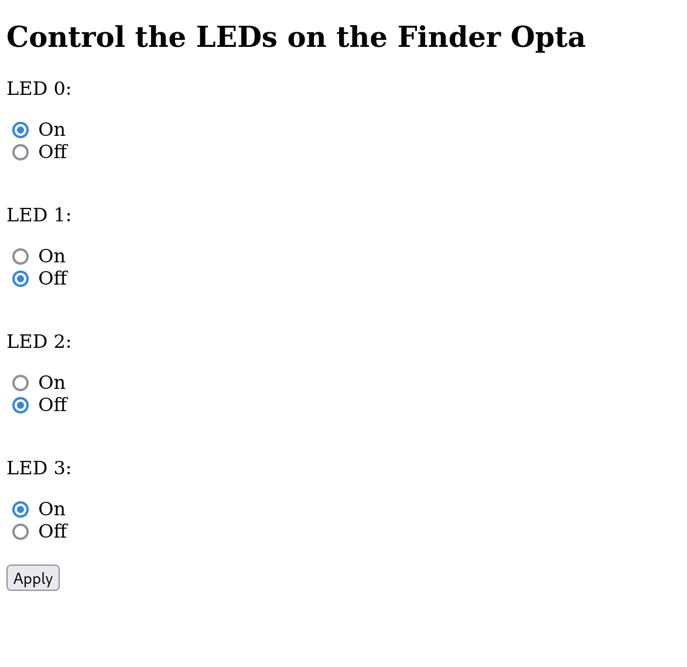

## Overview

In the previous examples we showed [how to configure an IP address on the
Finder
Opta](https://github.com/dndg/FinderOptaEthernetTutorial/blob/main/content.md)
and [how to use the Ethernet and HTTP libraries to send `POST` requests to a
remote HTTP server](https://github.com/dndg/FinderOptaHttpClientTutorial). In
this tutorial, we will instead instruct the Finder Opta to act as the server:
the device will receive `POST` or `GET` requests from a client connected via
Ethernet, and it will read their content in order to provide a response or to
perform a task.

## Goals

* Learn how to handle HTTP requests of type `POST` and `GET` on the Finder
  Opta, by developing a simple Web Server with multiple endpoints.
* Learn how to read requests and generate responses in JSON format.

## Required Hardware and Software

### Hardware Requirements

* Finder Opta PLC (x1).
* USB-C® cable (x1).
* ETH RJ45 cable (x1).

### Software Requirements

* [Arduino IDE 1.8.10+](https://www.arduino.cc/en/software), [Arduino IDE
2.0+](https://www.arduino.cc/en/software) or [Arduino Web
Editor](https://create.arduino.cc/editor).
* If you choose an offline Arduino IDE, you must install the
`ArduinoHttpClient` and the `ArduinoJson` libraries. You can install them using
the Library Manager of the Arduino IDE.
* [Example code](assets/OptaWebServerExample.zip).

## Finder Opta and then Ethernet and HTTP protocols

Using the `Ethernet` library, the Finder Opta can start a Web Server listening
on a specific port. This means that the device will wait for a client
connection in order to receive its requests. Once it receives them, the Finder
Opta can use the `ArduinoHttpClient` library to easily parse them.

## Finder Opta and the JSON format

Using the `ArduinoJson` library, the Finder Opta can easily read and generate
documents in JSON format. In our example, this is particularly convenient to
read `POST` requests and to generate HTTP responses that containt the state of
the LEDs of the Finder Opta.

## Instructions

### Setting up the Arduino IDE

This tutorial will need [the latest version of the Arduino
IDE](https://www.arduino.cc/en/software). If it is your first time setting up
the Finder Opta, check out the [getting started
tutorial](/tutorials/opta/getting-started).

Make sure you install the latest version of the
[`ArduinoHttpClient`](https://www.arduino.cc/reference/en/libraries/arduinohttpclient/)
and [`ArduinoJson`](https://arduinojson.org) libraries, as they will be used to
read and create the content of HTTP requests and responses.

For further details on how to manually install libraries refer to [this
article](https://support.arduino.cc/hc/en-us/articles/5145457742236-Add-libraries-to-Arduino-IDE).

### Connectivity

The only requirement for this tutorial is that the Finder Opta must be
connected via Ethernet to a device that can route the packets from the Finder
Opta to the HTTP client and viceveversa.

### Code Overview

The goal of the following example is to run on the Finder Opta a Web Server
which can receive HTTP requests that control its LEDs. The Web Server should
identify the method and the path of the requests, in particular:

* In case of `GET` request towards the path `/` the Web Server will respond by
  sending an HTML page containing a Javascript script, that allows to control
  the LEDs of the Finder Opta and show their statuses.
* In case of any other type of request towards the path `/` the Web Server will
  respond with an HTTP error `400 Bad Request`.
* In case of `GET` request towards the path `/led` the Web Server will respond
  by sending a JSON containing the state of the LEDs of the Finder Opta.
* In case of `POST` request towards the path `/led` the Web Server will receive
  a command in JSON format that specifies how to set the state of the LEDs of
  the device. The Finder Opta will execute this command and it will respond
  with a JSON containing the updated states of the LEDs.
* In case of any other type of request towards the path `/led` the Web Server
  will respond with an HTTP error `400 Bad Request`.
* In case of requests towards any path other than `/` or `led` the Web Server
  will respond with an HTTP error `404 Not Found`.

#### Sketch setup

At the start of the sketch we declare some constants:

```cpp
#define HOME_PATH "/"
#define LED_PATH "/led"
#define HTTP_GET "GET"
#define HTTP_POST "POST"
#define MAX_METHOD_LEN 16
#define MAX_PATH_LEN 2048
```

In particular we define the methods and the pats supported by the Web
Server,and also their maximum length inside HTTP requests. Later, we declare
the variables needed to start a Web Server which is reachable at a certain
static IP address and at a given port:

```cpp
OptaBoardInfo *info;
OptaBoardInfo *boardInfo();

// IP address of the Opta server.
IPAddress ip(192, 168, 10, 15);
int port = 80;
// Ethernet server on port 80.
EthernetServer server(port);
```

Next we declare two objects of type `StaticJsonDocument` that we will use
respectively for requests and responses:

```cpp
// Reserve 128 bytes for the JSON.
StaticJsonDocument<128> res;
StaticJsonDocument<128> req;
```

Finally we will declare the array of strings that hold the states of the LEDs
from number 0 to number 3, mapping their value with strings so that we can
easily handle the LEDs via HTTP requests without needing the user to enter the
correct integer value corrisponding to the desired LED state. This mapping will
also allow us to easily generate the content of the responses provided by our
Web Server in a way that is understandable by the user.

```cpp
// LEDs states.
String ledStates[] = {"LOW", "LOW", "LOW", "LOW"};
```

In the `setup()` function we will simply assign a static IP address to the
Finder Opta, then we will start the server:

```cpp
void setup()
{
    Serial.begin(9600);

    info = boardInfo();
    // Check if secure informations are available since MAC Address is among them.
    if (info->magic = 0xB5)
    {
        // Assign static IP address.
        Ethernet.begin(info->mac_address, ip);
    }
    else
    {
        while (1)
        {
        }
    }

    // Start the server.
    server.begin();
}
```

#### Main loop

The `loop()` function of this sketch listens for clients, until one is
connected. At that point the server will initialize an HTTP client and it will
verify if there are incoming requests.

```cpp
void loop()
{
    // Check if any client is available.
    EthernetClient client = server.available();
    if (client)
    {
        HttpClient http = HttpClient(client, ip, port);
        IPAddress clientIP = client.remoteIP();
        Serial.println("Client with address " + clientIP.toString() + " available.");

        while (client.connected())
        {
            if (client.available())
            {

```

Next, the server will read the method and the path of the request using the
`getHttpMethodAndPath()` function:

```cpp
                // Read HTTP method and path from the HTTP call.
                char method[MAX_METHOD_LEN], path[MAX_PATH_LEN];
                getHttpMethodAndPath(&http, method, path);
```

This function reads the bytes of the request until it reaches a separator, and
it first save the HTTP method and then the path of the request, both inside a
null-terminated `char` array:

```cpp
void getHttpMethodAndPath(HttpClient *http, char *method, char *path)
{
    size_t l = http->readBytesUntil(' ', method, MAX_METHOD_LEN - 1);
    method[l] = '\0';

    l = http->readBytesUntil(' ', path, MAX_PATH_LEN - 1);
    path[l] = '\0';
}
```

At this point, the server will compare the method and the path to the constants
we defined earlier, to determine which actions it should perform, based on the
behaviours we explained previously in this tutorial.

The following code takes care of the `/` endpoint:

```cpp
                // If path matches "/".
                if (strncmp(path, HOME_PATH, MAX_PATH_LEN) == 0)
                {
                    Serial.println("Client with address " + clientIP.toString() + " connected to '/'...");
                    // This endpoint only accepts GET requests.
                    if (strncmp(method, HTTP_GET, MAX_METHOD_LEN) == 0)
                    {
                        sendHomepage(&client);
                    }
                    else
                    {
                        badRequest(&client);
                    }
                }
```

In case of `GET` requests the function `sendHomepage` is called. We see its
code below:

```cpp
void sendHomepage(EthernetClient *client)
{
    client->println("HTTP/1.1 200 OK");
    client->println("Connection: close");
    client->println("Content-Type: text/html");

    String html = R"(
    <!DOCTYPE html>
    <html>
    <body>
        <h2>Control the LEDs on the Finder Opta</h2>
        <form id="form">
            <p>LED 0:</p>
            <input type="radio" id="LED_D0" name="LED_D0" value="HIGH">
            <label for="HIGH">On</label><br>
            <input type="radio" id="LED_D0" name="LED_D0" value="LOW">
            <label for="LOW">Off</label><br>
            <br>
            <p>LED 1:</p>
            <input type="radio" id="LED_D1" name="LED_D1" value="HIGH">
            <label for="HIGH">On</label><br>
            <input type="radio" id="LED_D1" name="LED_D1" value="LOW">
            <label for="LOW">Off</label><br>
            <br>
            <p>LED 2:</p>
            <input type="radio" id="LED_D2" name="LED_D2" value="HIGH">
            <label for="HIGH">On</label><br>
            <input type="radio" id="LED_D2" name="LED_D2" value="LOW">
            <label for="LOW">Off</label><br>
            <br>
            <p>LED 3:</p>
            <input type="radio" id="LED_D3" name="LED_D3" value="HIGH">
            <label for="HIGH">On</label><br>
            <input type="radio" id="LED_D3" name="LED_D3" value="LOW">
            <label for="LOW">Off</label><br>
            <br>
            <button type="submit" id="submit-btn">Apply</button>
        </form>
        <script type="application/javascript">
            const form = document.getElementById('form');
            const dataPromise = fetch('http://192.168.10.15:80/led')
                .then(res => res.json())
                .then(data => { return data; });
            window.onload = async () => {
                let data = await dataPromise;
                form["LED_D0"].value = data["LED_D0"];
                form["LED_D1"].value = data["LED_D1"];
                form["LED_D2"].value = data["LED_D2"];
                form["LED_D3"].value = data["LED_D3"];
            };
            form.addEventListener('submit', async event => {
                event.preventDefault();
                const formData = new FormData(form);
                const body = JSON.stringify(Object.fromEntries(formData));
                try {
                    const res = await fetch(
                        'http://192.168.10.15:80/led',
                        {
                            method: 'POST',
                            body: body,
                        },
                    );
                    const data = await res.json();
                    let isOk = false;
                    if (res.ok) {
                        isOk = form["LED_D0"].value == data["LED_D0"];
                        isOk = form["LED_D1"].value == data["LED_D1"];
                        isOk = form["LED_D2"].value == data["LED_D2"];
                        isOk = form["LED_D3"].value == data["LED_D3"];
                        if (isOk) {
                            alert('LEDs were set.');
                        } else {
                            alert('LEDs were not set.');
                        }
                    } else {
                        alert('Server error.');
                    }
                } catch (err) {
                    console.log(err.message);
                }
            });
        </script>
    </body>
    </html>)";

    client->println("Content-Length: " + String(html.length() + 1));
    client->println();
    client->println(html);

    Serial.println("OK [200]");
}
```

This means the server will send an HTML page containing a Javascript script
which allows to control the LEDs of the Finder Opta. The page is shown below:



The following code implements the `/led` endpoint:

```cpp
                // If path matches "/led".
                else if (strncmp(path, LED_PATH, MAX_PATH_LEN) == 0)
                {
                    Serial.println("Client with address " + clientIP.toString() + " connected to '/led'...");
                    // This endpoint accepts both GET and POST requests.
                    if (strncmp(method, HTTP_GET, MAX_METHOD_LEN) == 0)
                    {
                        // Respond to GET with LEDs states.
                        sendLEDsStates(&client);
                    }
                    else if (strncmp(method, HTTP_POST, MAX_METHOD_LEN) == 0)
                    {
                        // Skip headers and read POST request body.
                        http.skipResponseHeaders();
                        String body = http.readString();

                        // In case of POST requests with a body change LEDs states.
                        if (body != "")
                        {
                            parseRequest(body);
                        }

                        // In case of POST requests also respond with LEDs states.
                        sendLEDsStates(&client);
                    }
                    else
                    {
                        badRequest(&client);
                    }
                }
```

In case of `GET` request the server calls the function `sendLEDsStates`, which
generates a response in JSON format containing the state of the LEDs of the
Finder Opta:

```cpp
void sendLEDsStates(EthernetClient *client)
{
    // Sent HTTP headers.
    client->println("HTTP/1.1 200 OK");
    client->println("Connection: close");
    client->println("Content-Type: application/json");

    // Read LEDs states.
    for (int i = 0; i <= 3; i++)
    {
        String field = "LED_D" + String(i);
        res[field] = ledStates[i];
    }

    // Compute JSON body Content Length and finisha headers.
    String size = String(measureJsonPretty(res));
    client->println("Content-Length: " + size);
    client->println();

    // Send serialized JSON body.
    String resBody;
    serializeJsonPretty(res, resBody);
    client->println(resBody);

    Serial.println("OK [200]");
}
```

Instead, in case of `POST` request the function `parseRequest()` is called. Its
code is shown below:

```cpp
void parseRequest(String body)
{
    // Deserialize request body.
    char bodyChar[body.length() + 1];
    body.toCharArray(bodyChar, sizeof(bodyChar));
    DeserializationError error = deserializeJson(req, bodyChar);

    // Test if parsing succeeds.
    if (error)
    {
        Serial.print("JSON deserialization error: ");
        Serial.println(error.f_str());
        return;
    }
    else
    {
        // Print the request and change LEDs states accordingly.
        Serial.print("Request: ");
        for (int i = 0; i <= 3; i++)
        {
            String led = "LED_D" + String(i);
            String value = req[led];
            controlLED(i, value);
            Serial.print(led + " to " + value + ", ");
        }
        Serial.println();
    }
}
```

This function deserializes the content of the JSON inside the body of the
`POST` request using the `deserializeJson()` function provided by the
`ArduinoJson` library. Next, the function uses the instructions found in the
JSON to control the LEDs from 0 to 3 of the Finder Opta, using the function
`controlLED()`:

```cpp
void controlLED(int led, String value)
{
    if (getState(value) != -1)
    {
        ledStates[led] = value;
    }
    switch (led)
    {
    case 0:
        digitalWrite(LED_D0, getState(ledStates[led]));
        break;
    case 1:
        digitalWrite(LED_D1, getState(ledStates[led]));
        break;
    case 2:
        digitalWrite(LED_D2, getState(ledStates[led]));
        break;
    case 3:
        digitalWrite(LED_D3, getState(ledStates[led]));
        break;
    }
}
```

This function updates the variable that contains the states of the LED of the
FinderOpta passed as parameter, and then it pilots the LED with a
`digitalWrite()`, mapping the string received in the request to a LED state
using the `getState()` function. Note that, in case of invalid state inside the
request the LED will remain in its original state.

Once we finished these operations, even in this case, the server will call the
function `sendLEDsStates`, sending as response a JSON containing the state of
the LEDs of the Finder Opta. We can conclude by saying that using the `/led`
endpoint the server updates the LEDs and it returns their state. For this
reason the web page provided by the `/` endpoint interacts with the server at
this path allowing the user to interact with the device via its browser. The
user can in fact indicate the desired state of each LED and apply the command
clicking the _Apply_ button. In case of success the browser will show a
confirmation pop-up and the LEDs on the Finder Opta will turn on or off as
indicated, completing the set of functionalities we desired from our Web
Server.

For each endpoint, in case of malformed requests the server will respond
invoking the `badRequest()` function, while in case of invalid path it will
call the function `notFound()`. Finally, in all cases the server will need to
empty the receiving buffer at the end of each request, calling the function
`consumeRxBuffer()`:

```cpp
void consumeRxBuffer(HttpClient *http)
{
    // Consume headers in RX buffer.
    http->skipResponseHeaders();
    // Consume body in RX buffer if it exists.
    if (http->contentLength() > 0)
    {
        http->responseBody();
    }
}
```

#### Format of requests and responses

The server expects to receive `GET` requests, or `POST` requests with a body in
a similar format:

```json
{
    "LED_D0": "LOW",
    "LED_D1": "HIGH",
    "LED_D2": "HIGH",
    "LED_D3": "LOW"
}
```

In this JSON document we find the name of the LEDs with the relative states:
the allowed values are the ones shown above. A possible example of interaction
with the server is given by the command:

```bash
curl -d '{"LED_D0":"LOW", "LED_D1":"HIGH", "LED_D2":"HIGH", "LED_D3":"LOW"}' -H "Content-Type: application/json" http://192.168.10.15:80/led
```

Alternatively, the user can take advantage of the web page provided by the
Finder Opta at the `/` endpoint, which as previously explained will send and
receive properly formatted requests and responses.

#### Server side logging

The Web Server will print on the serial monitor a log of the requests it
received, allowing to track the behavior of the client. An example of the
output is attached below:

```text
Client with address 192.168.10.1 available.
Client with address 192.168.10.1 connected to '/'...
OK [200]
Client with address 192.168.10.1 disconnected.
Client with address 192.168.10.1 available.
Client with address 192.168.10.1 connected to '/led'...
OK [200]
Client with address 192.168.10.1 disconnected.
Client with address 192.168.10.1 available.
Client with address 192.168.10.1 connected to '/led'...
Request: LED_D0 to HIGH, LED_D1 to HIGH, LED_D2 to HIGH, LED_D3 to HIGH,
OK [200]
Client with address 192.168.10.1 disconnected.
Client with address 192.168.10.1 available.
Client with address 192.168.10.1 attempted connection to /test
Not Found [404]
Client with address 192.168.10.1 disconnected.
```

In this case, the client requested the web page which was later populated with
a `GET` call to the `/led` endpoint, made by the Javascript included in the
page. Next, the user applied a change of state: the content of the request was
printed on the terminal. Finally, the user tried to reach an endpoint which is
not supported, so it received an HTTP error `404 Not Found`.

## Conclusion

This tutorial shows how to implement on the Finder Opta a multi-endpoint Web
Server that is able to receive and decode HTTP requests via Ethernet. In
particular, the content of such requests, has been used to control the LEDs of
the Finder Opta, allowing to interact with the device from a web page which was
also served by the server itself.
